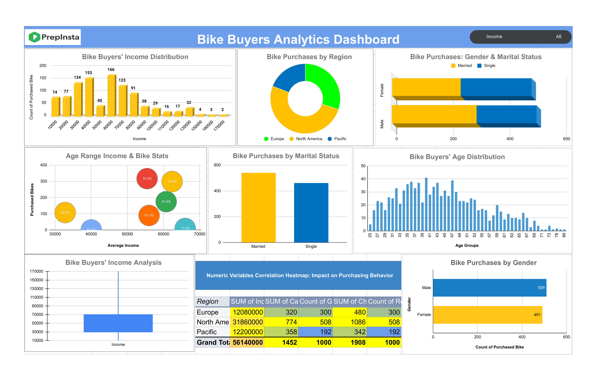

# PrepInsta Data Analytics Internship - Week 1

Welcome to my Week 1 progress in the PrepInsta Data Analytics Internship! 🚀 In this repository, you'll find an overview of the tasks completed during the first week and the insights gained.

## Tasks Completed

1. **Bar Chart (Marital Status):**
   - Explored how bike purchases vary among different marital statuses.
   - Utilized a pivot table and created a bar chart for visualization.

2. **Bar Chart (Gender):**
   - Investigated the influence of gender on bike purchases.
   - Employed a pivot table and visualized the findings with a bar chart.

3. **Histogram (Income):**
   - Analyzed the distribution of income among bike buyers.
   - Used a pivot table to categorize income into bins and created a bar chart.

4. **Histogram (Age):**
   - Explored the age distribution of bike buyers.
   - Employed a pivot table to categorize age into bins and visualized the results.

5. **Box Plot (Income):**
   - Examined outliers and key statistics in the income distribution.
   - Created a box plot using the original dataset.

6. **Pie Chart (Region):**
   - Represented the distribution of bike purchases by region.
   - Utilized a pivot table and created a pie chart.

7. **Scatter Plot (Income vs. Age):**
   - Investigated the relationship between income and age.
   - Created a scatter plot for visualization.

8. **Stacked Bar Chart (Marital Status & Gender):**
   - Analyzed the distribution of bike purchases considering both marital status and gender simultaneously.
   - Utilized a pivot table and created a stacked bar chart.

9. **Correlation Heatmap (Numeric Variables):**
   - Visualized the correlation matrix between numeric variables.
   - Used a heatmap or bubble chart to showcase correlations.

## Insights and Analysis

Share any notable insights or patterns observed during the tasks. Mention how these findings might impact purchasing behavior or provide valuable information.

## Dashboard

Check out the interactive dashboard summarizing the Week 1 insights:
[Week 1 Dashboard](https://docs.google.com/spreadsheets/d/15nEputPwtJWYORu2sp6BeF5a44zASP9B59nu6hZqvBg/edit?usp=sharing)

.
