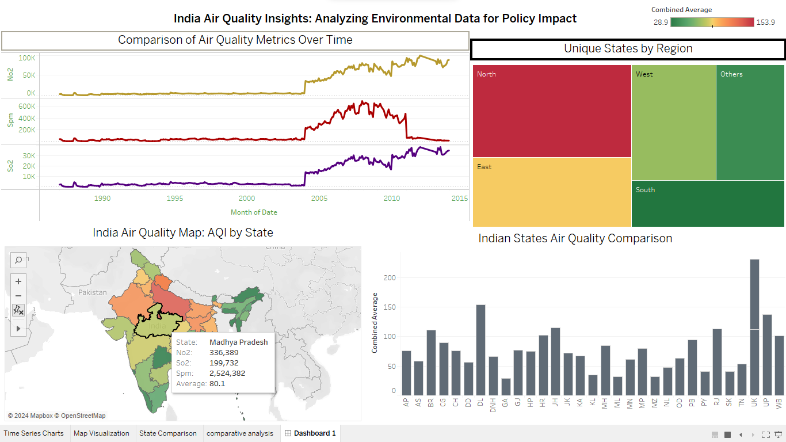

# Data Visualization with Tableau

## Overview
This repository contains the project files for my Week 7 project at the PrepInsta Winter Internship, where I worked on visualizing India's air quality data using Tableau.

## Project Highlights
- Created an interactive Tableau dashboard to visualize air quality data.
- Explored trends and patterns in air quality across different regions.
- Enhanced skills in data visualization and storytelling through compelling visualizations.
- Applied data analysis techniques to derive actionable insights.

### Dashboard Components
The Tableau dashboard includes:
- Map Visualization
- Time Series Charts
- Policy Change Timeline
- Filter Options
- Comparative Analysis
- Top Pollutant Analysis
- Insightful Annotations

## Future Work
In the future, I plan to:
- Include more interactive elements in the dashboard.
- Incorporate additional data sources for a more comprehensive analysis.
